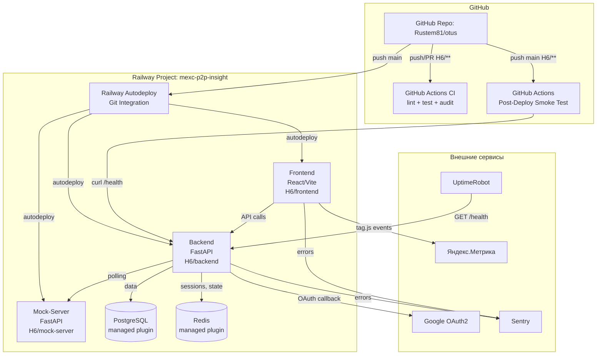
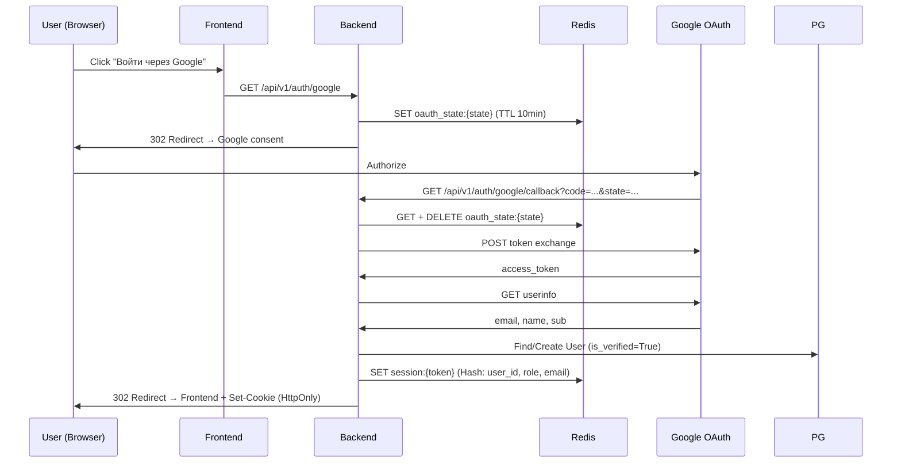
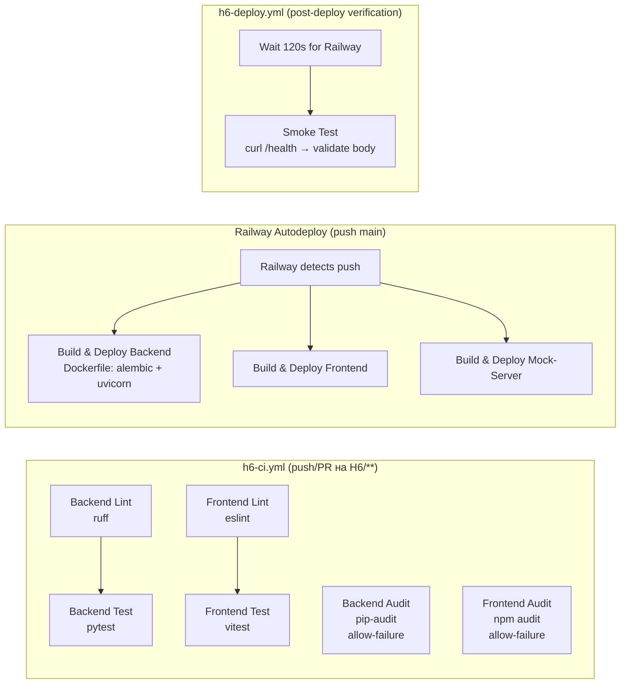

# Дизайн-документ — H6: CI/CD и интеграция сервисов

## 1. Обзор архитектуры

### 1.1. Системная диаграмма



### 1.2. Топология Railway-проекта

**Один Railway Project `mexc-p2p-insight`** с тремя services и двумя managed plugins:

| Компонент | Тип | Root Directory | Публичный домен | Watch Paths |
|-----------|-----|---------------|-----------------|-------------|
| backend | Service (Dockerfile) | `H6/backend` | Да (HTTPS) | `H6/backend/**` |
| frontend | Service (Dockerfile) | `H6/frontend` | Да (HTTPS) | `H6/frontend/**` |
| mock-server | Service (Dockerfile) | `H6/mock-server` | Нет (internal only) | `H6/mock-server/**` |
| PostgreSQL | Managed Plugin | — | Нет | — |
| Redis | Managed Plugin | — | Нет | — |

**Переменные окружения по сервисам:**

| Переменная | backend | frontend | mock-server |
|------------|---------|----------|-------------|
| `DATABASE_URL` | `${{Postgres.DATABASE_URL}}` | — | — |
| `REDIS_URL` | `${{Redis.REDIS_URL}}` | — | — |
| `SECRET_KEY` | random string | — | — |
| `BACKEND_CORS_ORIGINS` | frontend Railway URL | — | — |
| `GOOGLE_CLIENT_ID` | из Google Console | — | — |
| `GOOGLE_CLIENT_SECRET` | из Google Console | — | — |
| `GOOGLE_REDIRECT_URI` | backend Railway URL + path | — | — |
| `SENTRY_DSN_BACKEND` | из Sentry | — | — |
| `P2P_MOCK_BASE_URL` | `http://mock-server.railway.internal:8001` | — | — |
| `VITE_API_URL` | — | backend Railway URL | — |
| `VITE_YM_COUNTER_ID` | — | из Яндекс.Метрики | — |
| `VITE_SENTRY_DSN` | — | из Sentry | — |

**Internal networking:** mock-server доступен backend по `http://mock-server.railway.internal:8001` (Railway private networking, без публичного домена).

### 1.3. Поток данных OAuth2



**Формат сессии:** Session token — opaque random string (не JWT), передаётся клиенту в `HttpOnly; Secure; SameSite=Lax` cookie `session_token`. Не хранится в localStorage.

**Email verification:** Для Google OAuth-пользователей email считается верифицированным (`is_verified=True`), т.к. Google гарантирует подтверждение email.

**Retry / Rate Limiting:** Retry к Google API не реализуется. При ошибке Google (502/503/timeout) — логируем и возвращаем пользователю ошибку. Rate limiting OAuth-запросов остаётся за пределами задания.

### 1.4. CI/CD Pipeline и стратегия деплоя

**Принципиальное решение: разделение ответственности CI/CD**

| Ответственность | Кто выполняет | Механизм |
|-----------------|---------------|----------|
| Lint, test, audit | GitHub Actions (`h6-ci.yml`) | На push/PR в H6/** |
| Деплой сервисов | **Railway Git Integration** (автодеплой) | На push в main, Watch Paths |
| Миграции БД | **Dockerfile backend** (entrypoint) | `alembic upgrade head` перед стартом uvicorn |
| Smoke-test после деплоя | GitHub Actions (`h6-deploy.yml`) | Ожидание + curl /health |

**GitHub Actions НЕ деплоит.** Деплой выполняет исключительно Railway через Git Integration. Workflow `h6-deploy.yml` — это **post-deploy verification**, а не deploy pipeline.



**Стратегия миграций БД:**
- Миграции запускаются **внутри Dockerfile backend** как часть entrypoint: `alembic upgrade head && uvicorn ...`
- Это гарантирует, что миграции выполняются **до старта приложения** при каждом деплое
- Миграции должны быть идемпотентны (Alembic отслеживает версии, повторный запуск — no-op)
- GitHub Actions **не запускает миграции** — это ответственность контейнера

**Стратегия обработки провала smoke-test:**
- Smoke-test в `h6-deploy.yml` проверяет не только HTTP 200, но и тело ответа: `status == "ok"`
- При провале (HTTP != 200 или status != "ok") — job помечается как failed
- Автоматический rollback **не реализован** — восстановление руками через Railway UI (redeploy предыдущего коммита, 1 клик)
- Это осознанное ограничение для учебного проекта

**Audit steps в CI:**
- `pip-audit` и `npm audit` отмечены как `continue-on-error: true` (allow-failure)
- **CI не блокирует merge** при обнаружении уязвимостей — решение о фиксе принимается разработчиком через `security_audit.md`
- Результаты фиксируются в логах GitHub Actions и используются для формирования отчёта

**Политика severity для audit:**
- High/Critical — must-fix или явный exception с обоснованием в `security_audit.md`
- Medium/Low — по усмотрению, но обязательно задокументировать

---

## 2. Структура файлов (новые и изменённые)

```
otus/                                    # корень monorepo
├── .github/workflows/
│   ├── h6-ci.yml                        # NEW: CI pipeline (lint, test, audit)
│   └── h6-deploy.yml                    # NEW: Post-deploy smoke-test (NOT deploy itself)
│
└── H6/
    ├── backend/
    │   ├── app/
    │   │   ├── api/v1/
    │   │   │   ├── endpoints/
    │   │   │   │   ├── auth_oauth.py    # NEW: OAuth2 routes
    │   │   │   │   └── health.py        # MODIFIED: extended health
    │   │   │   └── router.py            # MODIFIED: add oauth routes
    │   │   ├── core/
    │   │   │   ├── config.py            # MODIFIED: new env vars
    │   │   │   └── logging_config.py    # NEW: structlog setup
    │   │   ├── middleware/
    │   │   │   └── request_id.py        # NEW: X-Request-ID
    │   │   ├── models/
    │   │   │   └── user.py              # MODIFIED: oauth fields
    │   │   ├── services/
    │   │   │   └── oauth_google.py      # NEW: Google OAuth logic
    │   │   └── main.py                  # MODIFIED: structlog, sentry
    │   ├── alembic/versions/
    │   │   └── xxxx_add_oauth_fields.py # NEW: migration
    │   ├── pyproject.toml               # MODIFIED: new deps
    │   └── Dockerfile                   # MODIFIED: entrypoint = alembic upgrade head + uvicorn
    │
    ├── frontend/
    │   ├── src/
    │   │   ├── lib/
    │   │   │   └── analytics.ts         # NEW: Яндекс.Метрика
    │   │   ├── pages/
    │   │   │   ├── login.tsx            # MODIFIED: Google button
    │   │   │   └── auth-callback.tsx    # NEW: OAuth callback page
    │   │   ├── components/
    │   │   │   └── ErrorBoundary.tsx    # NEW: Sentry fallback
    │   │   ├── main.tsx                 # MODIFIED: Sentry, Metrika init
    │   │   └── vite-env.d.ts            # MODIFIED: ym types
    │   ├── package.json                 # MODIFIED: @sentry/react
    │   └── Dockerfile                   # EXISTS (from H5)
    │
    ├── mock-server/
    │   └── Dockerfile                   # EXISTS (from H5)
    │
    ├── monitoring/                       # NEW: optional
    │   ├── prometheus/prometheus.yml
    │   └── grafana/
    │       ├── provisioning/
    │       │   ├── datasources/prometheus.yml
    │       │   └── dashboards/dashboard.yml
    │       └── dashboards/mexc-p2p.json
    │
    ├── docker-compose.yml               # MODIFIED: prometheus, grafana
    ├── .env.example                     # MODIFIED: all new vars
    ├── security_audit.md                # NEW
    ├── integration_documentation.md     # NEW
    └── README.md                        # NEW
```

---

## 3. Компонентный дизайн

### 3.1. CI/CD Pipeline (Требования 1, 2)

**Файл:** `.github/workflows/h6-ci.yml`

```yaml
name: H6 CI
on:
  push:
    paths: ['H6/**', '.github/workflows/h6-*.yml']
  pull_request:
    paths: ['H6/**']

jobs:
  backend-lint-test:
    runs-on: ubuntu-latest
    defaults:
      run:
        working-directory: H6/backend
    steps:
      - uses: actions/checkout@v4
      - uses: actions/setup-python@v5
        with: { python-version: '3.11' }
      - run: pip install -e ".[dev]"
      - run: ruff check .
      - run: pytest

  backend-security:
    runs-on: ubuntu-latest
    continue-on-error: true  # allow-failure
    defaults:
      run:
        working-directory: H6/backend
    steps:
      - uses: actions/checkout@v4
      - run: pip install pip-audit
      - run: pip-audit

  frontend-lint-test:
    runs-on: ubuntu-latest
    defaults:
      run:
        working-directory: H6/frontend
    steps:
      - uses: actions/checkout@v4
      - uses: actions/setup-node@v4
        with: { node-version: '20' }
      - run: npm ci
      - run: npm run lint
      - run: npm run test -- --run

  frontend-audit:
    runs-on: ubuntu-latest
    continue-on-error: true  # allow-failure
    defaults:
      run:
        working-directory: H6/frontend
    steps:
      - uses: actions/checkout@v4
      - run: npm audit --audit-level=high
```

**Файл:** `.github/workflows/h6-deploy.yml` (post-deploy verification, НЕ деплой)

```yaml
name: H6 Post-Deploy Verification
on:
  push:
    branches: [main]
    paths: ['H6/**']

jobs:
  smoke-test:
    runs-on: ubuntu-latest
    steps:
      - name: Wait for Railway autodeploy to complete
        run: sleep 180  # Railway build + deploy ~2-3 min

      - name: Smoke test - verify /health status
        run: |
          RESPONSE=$(curl -sf ${{ vars.BACKEND_URL }}/health)
          echo "Health response: $RESPONSE"
          STATUS=$(echo "$RESPONSE" | jq -r '.status')
          if [ "$STATUS" != "ok" ]; then
            echo "FAIL: /health status is '$STATUS', expected 'ok'"
            exit 1
          fi
          echo "PASS: Backend is healthy"
```

**Ключевое решение:** GitHub Actions **не выполняет деплой**. Деплой — ответственность Railway Git Integration. Workflow `h6-deploy.yml` — это post-deploy verification:
1. Ждёт завершения Railway autodeploy (~3 мин)
2. Проверяет тело ответа `/health` (не только HTTP code, но и `status == "ok"`)
3. При `status == "degraded"` — job failed, сигнал разработчику о проблеме

---

### 3.2. Security Audit (Требование 3)

**Подход:**
1. Автоматический аудит в CI (`pip-audit`, `npm audit`) — `continue-on-error: true`, не блокирует merge
2. Ручной OWASP-анализ кода AI-агентом
3. Результат: `H6/security_audit.md`

**Политика severity:**
- **High/Critical** — must-fix или явный exception с обоснованием
- **Medium/Low** — по усмотрению, обязательно задокументировать

**Структура security_audit.md:**
```markdown
# Аудит безопасности H6

## Методология
- pip-audit (Python dependencies)
- npm audit (Node dependencies)
- AI-анализ по OWASP Top 10 (XSS, CSRF, SQL injection, broken auth)

## Находки
| ID | Severity | Компонент | Описание | Статус | Коммит |
|----|----------|-----------|----------|--------|--------|

## Рекомендации
```

---

### 3.3. OAuth2 Google (Требование 4)

**Новые файлы Backend:**

`app/services/oauth_google.py`:
```python
class GoogleOAuthService:
    async def get_authorization_url(self) -> tuple[str, str]:
        """Generate opaque state, store in Redis with TTL 10min, return Google auth URL"""

    async def handle_callback(self, code: str, state: str) -> tuple[User, str]:
        """Verify state (GET+DELETE from Redis), exchange code, get userinfo, 
        find/create user (is_verified=True for OAuth), create session, return session_token"""

    async def _exchange_code(self, code: str) -> dict:
        """POST to https://oauth2.googleapis.com/token"""

    async def _get_userinfo(self, access_token: str) -> dict:
        """GET https://www.googleapis.com/oauth2/v2/userinfo"""
```

`app/api/v1/endpoints/auth_oauth.py`:
```python
@router.get("/auth/google")
async def google_login(redis: Redis = Depends(get_redis)):
    """Generate state, redirect to Google OAuth consent screen"""

@router.get("/auth/google/callback")
async def google_callback(code: str, state: str, ...):
    """Handle callback: verify state, exchange code, create session.
    Set HttpOnly cookie session_token. Redirect to frontend."""
```

**Сессии:**
- Session token — **opaque random string** (32 bytes, hex-encoded)
- Хранится в Redis: `session:{token}` → Hash `{user_id, role, email, created_at}`
- Передаётся клиенту в cookie: `Set-Cookie: session_token=...; HttpOnly; Secure; SameSite=Lax; Path=/`
- **Не хранится в localStorage** — только HttpOnly cookie

**Email verification:**
- Для Google OAuth-пользователей `is_verified=True` by default (Google гарантирует подтверждение email)
- Для пользователей с password-регистрацией — отдельная логика (не меняется)

**Error handling:**
- Google недоступен (502/503/timeout) → логируем, возвращаем пользователю "Сервис временно недоступен"
- Retry к Google API **не реализуется** (за пределами задания)
- Rate limiting OAuth-запросов **не реализуется** (за пределами задания)

**Миграция Alembic:**
```python
# alembic/versions/xxxx_add_oauth_fields.py
def upgrade():
    op.add_column('users', sa.Column('oauth_provider', sa.String(32), nullable=True))
    op.add_column('users', sa.Column('oauth_subject', sa.String(255), nullable=True))
    op.create_index('ix_users_oauth', 'users',
                    ['oauth_provider', 'oauth_subject'],
                    unique=True,
                    postgresql_where=text("oauth_provider IS NOT NULL"))

def downgrade():
    op.drop_index('ix_users_oauth')
    op.drop_column('users', 'oauth_subject')
    op.drop_column('users', 'oauth_provider')
```

**Frontend:**
- `login.tsx`: кнопка "Войти через Google" → `window.location.href = API_URL + '/api/v1/auth/google'`
- `auth-callback.tsx`: **UI-only страница** — не выполняет OAuth-логику. Роль:
  - Backend завершает OAuth (verify state, exchange code, set cookie) и делает `302 Redirect → /auth/callback?success=1` или `?error=...`
  - Frontend `auth-callback.tsx` читает query params, показывает spinner/ошибку, и при `success=1` делает redirect на `/`
  - Разделение: **backend владеет OAuth-логикой**, frontend только отображает результат

**Зависимости Backend:** `authlib>=1.3.0`, `httpx>=0.27.0`

---

### 3.4. Яндекс.Метрика (Требование 5)

**Файл:** `frontend/src/lib/analytics.ts`

```typescript
const COUNTER_ID = import.meta.env.VITE_YM_COUNTER_ID;

/**
 * Инициализация Яндекс.Метрики.
 * No-op если VITE_YM_COUNTER_ID не задан или не production.
 * Приложение работает без аналитики — тесты не падают.
 */
export function initMetrika(): void {
  if (!import.meta.env.PROD || !COUNTER_ID) return;
  // Динамическая загрузка https://mc.yandex.ru/metrika/tag.js
  // ym(COUNTER_ID, 'init', { clickmap: true, trackLinks: true, webvisor: true })
}

/**
 * Отправка pageview при смене роута (SPA).
 */
export function trackPageView(url: string): void {
  if (!import.meta.env.PROD || !COUNTER_ID) return;
  window.ym?.(Number(COUNTER_ID), 'hit', url);
}

/**
 * Отправка целевого события (reachGoal).
 */
export function trackEvent(goal: string, params?: Record<string, unknown>): void {
  if (!import.meta.env.PROD || !COUNTER_ID) return;
  window.ym?.(Number(COUNTER_ID), 'reachGoal', goal, params);
}
```

**Graceful degradation:** Если `VITE_YM_COUNTER_ID` не задан — все функции являются no-op, ошибок нет, тесты не падают, приложение работает без аналитики.

**Привязка событий к компонентам:**

| Событие (goal) | Где вызывается | Триггер |
|----------------|----------------|---------|
| `login` | `login.tsx` | После успешного `POST /auth/login` (200 OK) |
| `register` | `register.tsx` | После успешной регистрации |
| `oauth_login` | `auth-callback.tsx` | После успешного OAuth redirect |
| `view_ad` | `AdDetailDialog.tsx` | При открытии диалога объявления |
| `blacklist_add` | `blacklist.tsx` | После успешного `POST /blacklist` |

**Типы:** `vite-env.d.ts` — объявление `window.ym` как optional function

**Интеграция с React Router:** `useEffect` в корневом layout, вызов `trackPageView(location.pathname)` при смене `location`

---

### 3.5. Health Check и Мониторинг (Требование 6)

**Файл:** `app/api/v1/endpoints/health.py`

```python
@router.get("/health")
async def health_check(db: AsyncSession, redis: Redis):
    """Full health with dependency checks.
    Returns "ok" (all deps up) or "degraded" (some deps down).
    Always HTTP 200 — UptimeRobot проверяет status code."""
    dependencies = {
        "postgres": await check_postgres(db),
        "redis": await check_redis(redis),
        "mock_server": await check_mock_server(),
    }
    status = "ok" if all(v == "ok" for v in dependencies.values()) else "degraded"
    return {"status": status, "version": settings.APP_VERSION, "dependencies": dependencies}

@router.get("/health/live")
async def liveness():
    """Lightweight liveness probe — no dependency checks"""
    return {"status": "ok"}
```

**Статусы (только два, согласно Acceptance Criteria):**
- `"ok"` — все зависимости доступны
- `"degraded"` — хотя бы одна зависимость недоступна

**Версия приложения:** `APP_VERSION` — учебный статичный version tag, задаётся через env variable (default `"1.0.0"`). Не обновляется автоматически из git. В контексте автоматического деплоя это означает, что version в /health — информативный маркер, а не точный идентификатор билда. Для production-решения следовало бы брать из `git describe --tags` или `$RAILWAY_GIT_COMMIT_SHA`, но для учебного проекта это избыточно.

**UptimeRobot:** настраивается разработчиком вручную на prod URL `/health`, интервал 5 мин.

---

### 3.6. Структурированное логирование (Требование 7)

**Файл:** `app/core/logging_config.py`

```python
import structlog
import logging
import os

def configure_logging():
    """Configure structlog with JSON (prod) or console (dev) renderer."""
    log_format = os.getenv("LOG_FORMAT", "json" if os.getenv("RAILWAY_ENVIRONMENT") else "console")
    
    if log_format == "console":
        renderer = structlog.dev.ConsoleRenderer()
    else:
        renderer = structlog.processors.JSONRenderer()
    
    structlog.configure(
        processors=[
            structlog.contextvars.merge_contextvars,
            structlog.processors.add_log_level,
            structlog.processors.TimeStamper(fmt="iso"),
            renderer,
        ],
        wrapper_class=structlog.make_filtering_bound_logger(logging.INFO),
    )
```

**Разделение dev/prod:**
- `LOG_FORMAT=json` (default на Railway/production) — JSON для машинного парсинга
- `LOG_FORMAT=console` (default локально) — pretty console logs для удобства разработки
- Определяется автоматически: если есть `RAILWAY_ENVIRONMENT` → json, иначе → console

**Файл:** `app/middleware/request_id.py`

```python
from uuid import uuid4
import structlog

class RequestIDMiddleware:
    async def __call__(self, request, call_next):
        request_id = request.headers.get("X-Request-ID") or str(uuid4())
        structlog.contextvars.bind_contextvars(request_id=request_id)
        response = await call_next(request)
        response.headers["X-Request-ID"] = request_id
        structlog.contextvars.unbind_contextvars("request_id")
        return response
```

**Формат лога (production):**
```json
{"timestamp": "2025-01-15T10:30:00Z", "level": "info", "event": "request_completed", "request_id": "abc-123", "method": "GET", "path": "/api/v1/ads", "status": 200, "duration_ms": 45}
```

**Связь с alerting:** Логи с `level=ERROR` используются для ручного анализа инцидентов. Автоматических алертов по логам нет (кроме Sentry, если подключён). UptimeRobot мониторит только доступность `/health`.

---

### 3.7. Sentry (Требование 10, опционально)

**Backend:** `sentry_sdk.init()` в `main.py` с FastApiIntegration, SqlalchemyIntegration
- `before_send`: фильтрация полей `password`, `authorization`, `cookie`, `session_token`
- Передача `request_id` в Sentry context через `before_send`

**Frontend:** `@sentry/react` + `Sentry.init()` в `main.tsx`
- `ErrorBoundary` с fallback UI оборачивает роутер
- `browserTracingIntegration` для performance

---

### 3.8. Prometheus + Grafana (Требование 11, опционально)

**Backend:** `prometheus-fastapi-instrumentator` → `/metrics`

**Кастомные метрики:**
- `p2p_polling_duration_seconds` (Histogram)
- `p2p_ads_active_total` (Gauge)
- `auth_logins_total` (Counter, labels: method=password|google)

**Docker Compose:** сервисы `prometheus` и `grafana` с volume provisioning (только локально)

**Безопасность `/metrics`:**
- **Локально (docker-compose):** endpoint доступен только из внутренней Docker network. Prometheus скрейпит backend по имени сервиса (`backend:8000/metrics`). Порт `/metrics` не пробрасывается наружу.
- **На Railway:** endpoint `/metrics` **не экспонируется** — механизм: middleware проверяет `request.client.host` или заголовок `X-Forwarded-For`. Если запрос приходит извне Railway internal network → HTTP 403. Альтернатива (проще): `/metrics` защищён Bearer-токеном из env `METRICS_SECRET`, без которого возвращает 401.
- **Для учебного проекта:** допустимо оставить `/metrics` открытым на Railway, т.к. данные не содержат PII. Но в документации указать это как known limitation.

---

## 4. API Endpoints (новые)

| Method | Path | Описание | Auth |
|--------|------|----------|------|
| GET | `/api/v1/auth/google` | Redirect на Google consent | No |
| GET | `/api/v1/auth/google/callback` | OAuth callback → session cookie | No |
| GET | `/health` | Full health check (postgres, redis, mock) | No |
| GET | `/health/live` | Liveness probe (no deps) | No |
| GET | `/metrics` | Prometheus metrics | Internal only |

---

## 5. Изменения БД

### Миграция: add_oauth_fields

```sql
ALTER TABLE users ADD COLUMN oauth_provider VARCHAR(32) NULL;
ALTER TABLE users ADD COLUMN oauth_subject VARCHAR(255) NULL;
CREATE UNIQUE INDEX ix_users_oauth
    ON users (oauth_provider, oauth_subject)
    WHERE oauth_provider IS NOT NULL;
```

**Обратная совместимость:** поля nullable, существующие пользователи не затронуты.
**Идемпотентность:** миграция безопасна для повторного запуска (Alembic отслеживает версии).

---

## 6. Зависимости (новые)

### Backend (pyproject.toml)

```
authlib>=1.3.0
httpx>=0.27.0
structlog>=24.1.0
sentry-sdk[fastapi]>=2.0.0          # optional
prometheus-fastapi-instrumentator>=7.0.0  # optional
```

### Frontend (package.json)

```
@sentry/react: ^8.0.0               # optional
```

---

## 7. Распределение ответственности

### 🤖 AI (Kiro) делает:

| Область | Артефакты |
|---------|-----------|
| Подготовка H6 | копирование H5→H6, `.env.example`, README черновик |
| CI/CD workflows | `h6-ci.yml`, `h6-deploy.yml` |
| OAuth2 backend | `oauth_google.py`, `auth_oauth.py`, миграция Alembic |
| OAuth2 frontend | кнопка Google на login, callback page |
| Аналитика | `analytics.ts`, типы, интеграция trackEvent в компоненты |
| Health endpoints | расширение `/health`, добавление `/health/live` |
| Логирование | `logging_config.py`, `request_id.py` middleware |
| Sentry интеграция | init backend + frontend, ErrorBoundary, before_send |
| Prometheus | instrumentator, custom metrics, docker-compose, dashboard |
| Security audit | OWASP-анализ кода, черновик `security_audit.md`, патчи |
| Документация | черновики `integration_documentation.md`, `README.md` |

### 👤 Разработчик делает вручную:

| Область | Действия |
|---------|----------|
| Google Cloud Console | Создание проекта, consent screen, Client ID/Secret, test users, redirect URIs |
| Яндекс.Метрика | Регистрация счётчика, настройка целей (login, view_ad, etc.), проверка "В реальном времени" |
| Sentry | Регистрация, создание проектов Python + React, копирование DSN |
| UptimeRobot | Регистрация, создание HTTP-монитора на `/health`, настройка email-алертов |
| Railway | Создание проекта, 3 сервисов, plugins (PG + Redis), variables, generate domains |
| GitHub Secrets | `RAILWAY_TOKEN`, `GOOGLE_CLIENT_ID`, `GOOGLE_CLIENT_SECRET`, `SENTRY_DSN_*` |
| Ручное тестирование | OAuth flow в браузере, Метрика визиты/цели, Sentry test issue |
| Скриншоты | CI green, Sentry issue, Grafana dashboard, Metrika realtime |
| Финальная проверка | Вычитка документации, проверка ссылок, сдача на OTUS |

---

## 8. Свойства корректности (Correctness Properties)

| # | Свойство | Проверка |
|---|----------|----------|
| CP1 | CI запускается только при изменениях в H6/** или h6-*.yml | Path filter в workflow |
| CP2 | OAuth state одноразовый (GET+DELETE) и expires через 10 мин | Redis TTL + atomic delete |
| CP3 | OAuth callback с невалидным state → HTTP 400, лог warning | Unit test |
| CP4 | Новый OAuth user создаётся с oauth_provider, oauth_subject, is_verified=True | DB assertion |
| CP5 | Существующий user по email связывается с OAuth (update oauth_*) | DB assertion |
| CP6 | Session token — opaque string в HttpOnly cookie, не в localStorage | Response header check |
| CP7 | Метрика не загружается в development (no-op) | `import.meta.env.PROD` check |
| CP8 | trackEvent не бросает ошибку если ym не загружен или COUNTER_ID пуст | Optional chaining + guard |
| CP9 | /health возвращает "ok" или "degraded" (только два статуса) | Response schema test |
| CP10 | /health/live всегда возвращает 200 без проверки зависимостей | Direct test |
| CP11 | X-Request-ID пробрасывается во все логи запроса | Log assertion |
| CP12 | Входящий X-Request-ID используется вместо генерации нового | Header test |
| CP13 | JSON-логи содержат timestamp, level, event, request_id | Schema validation |
| CP14 | Sentry before_send фильтрует password, authorization, cookie | Unit test |
| CP15 | /metrics недоступен публично: Docker network (local) или Bearer-token/IP-check (Railway) | Middleware + network config |
| CP16 | Audit steps в CI — continue-on-error, не блокируют merge | Workflow config check |
| CP17 | Миграции идемпотентны, выполняются при каждом деплое | Alembic version tracking |

---

## 9. Стратегия тестирования

### Обязательный минимум тестов:
- **Unit-тесты OAuth:** verify state, exchange code (mock httpx), create/link user
- **Unit-тесты Health:** mock DB/Redis up/down → проверка "ok"/"degraded"
- **Unit-тесты Logging:** request_id propagation, JSON format
- **Frontend unit-тесты:** analytics.ts (mock window.ym), login page render

### Желательно (но не блокирует сдачу):
- Property-based тесты (hypothesis/fast-check) для state generation, session token uniqueness
- Integration тесты OAuth callback с test Redis

### E2E (ручное, выполняет разработчик):
- OAuth flow в браузере (success, cancel, invalid state)
- Метрика "В реальном времени" + цели
- CI/CD pipeline green после push

---

## 10. Порядок реализации

```
Фаза 0: Подготовка (копирование H5→H6, .env.example, README)
    ↓
Фаза 1: CI/CD (h6-ci.yml, h6-deploy.yml)
    ↓
Фаза 2: Security Audit (OWASP-анализ, security_audit.md)
    ↓
Фаза 3: Логирование (structlog, request_id middleware)
    ↓
Фаза 4: Health Check (/health расширение, /health/live)
    ↓
Фаза 5: OAuth2 Google (backend routes, migration, frontend)
    ↓
Фаза 6: Яндекс.Метрика (analytics.ts, trackEvent интеграция)
    ↓
Фаза 7: Sentry (опционально)
    ↓
Фаза 8: Prometheus + Grafana (опционально)
    ↓
Фаза 9: Документация (integration_documentation.md, README)
```

---

## 11. Known Deviations Policy

Мелкие расхождения между дизайн-документом и реализацией **допустимы**, если соблюдены:
- Все Acceptance Criteria из requirements.md
- Все Correctness Properties из этого документа
- Общая архитектура и распределение ответственности

Примеры допустимых отклонений:
- Другие имена файлов/функций (если логика та же)
- Немного другие сигнатуры (дополнительные параметры, другой return type)
- Использование альтернативной библиотеки с тем же функционалом
- Упрощение property-based тестов до обычных unit-тестов

Примеры **недопустимых** отклонений:
- Хранение session token в localStorage вместо HttpOnly cookie
- Отсутствие path filter в CI (запуск на все изменения)
- /health возвращает статусы, не описанные в AC (например "down")
- Audit блокирует merge (должен быть continue-on-error)
- GitHub Actions выполняет деплой (деплой — только Railway autodeploy)

---

## 12. Known Limitations (учебный проект)

| Ограничение | Обоснование | Production-решение |
|-------------|-------------|-------------------|
| Нет автоматического rollback при провале smoke-test | Избыточно для ДЗ | Railway API rollback или blue-green deploy |
| APP_VERSION — статичный tag | Нет CI/CD release pipeline | `git describe --tags` или `$RAILWAY_GIT_COMMIT_SHA` |
| `/metrics` может быть доступен публично на Railway | Данные не содержат PII | Bearer-token middleware или IP whitelist |
| Нет retry к Google OAuth API | Избыточно для ДЗ | Exponential backoff с circuit breaker |
| CI не блокирует merge при audit findings | Учебный проект, решение через security_audit.md | `continue-on-error: false` + exception policy |
| Smoke-test ждёт фиксированные 180s | Нет API для проверки статуса Railway deploy | Railway deploy hooks или polling Railway API |
