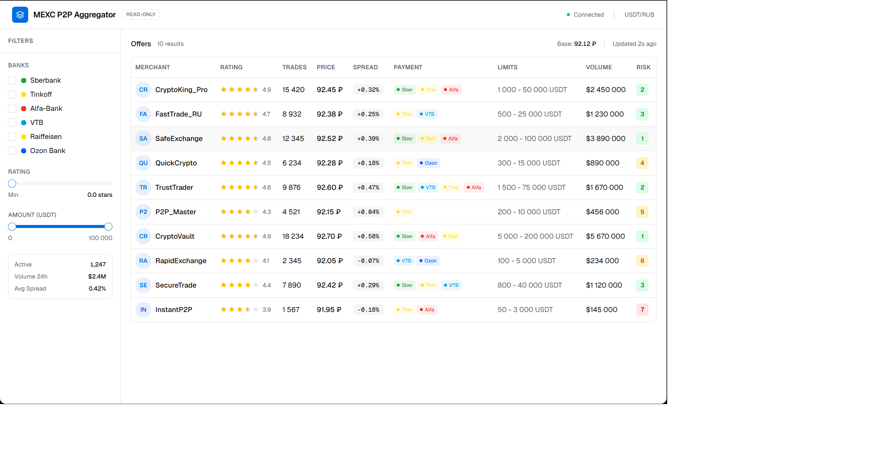
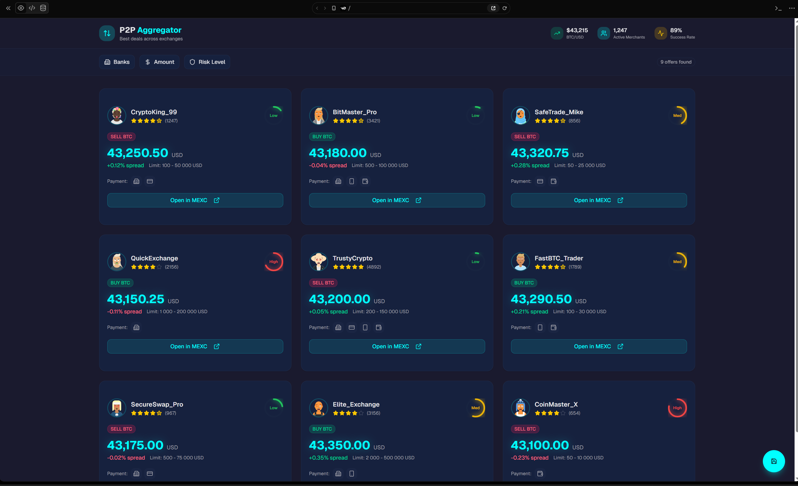
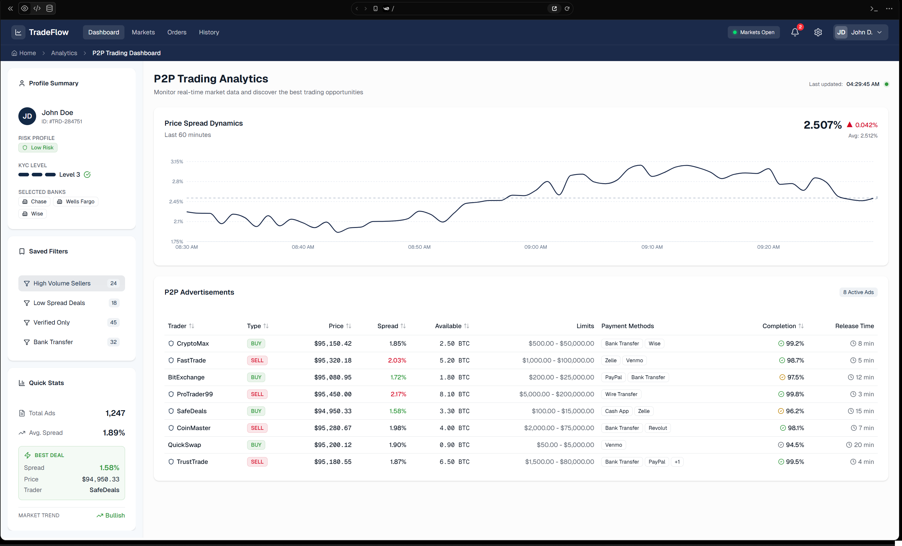

# UI-концепции: MEXC P2P Агрегатор

Сгенерировано 3 визуальных концепции интерфейса с использованием Text-to-UI инструментов.

**Инструменты для генерации:** v0.dev (Vercel), Bolt.new, Uizard, ChatGPT (описание + Midjourney/DALL-E для визуализации) — любой доступный Text-to-UI инструмент.

> **Примечание:** Вставьте скриншоты сгенерированных концепций в эту папку и обновите ссылки ниже.

---

## Концепция 1: Минималистичный дашборд (Light)

**Промпт для генерации:**
> "Create a clean minimalist web dashboard for P2P cryptocurrency trading aggregator. Main screen shows a data table with columns: merchant name, rating (stars), trades count, price, spread percentage, payment methods (bank icons), limits, volume, risk score (colored badge 1-10). Include a filter sidebar on the left with checkboxes for banks, sliders for rating and amount range. Use white background, subtle gray borders, blue accent color. Header shows 'MEXC P2P Aggregator' with a 'Read-only' badge."

**Стиль:** Минималистичный, светлая тема, акцент на данных

**Ключевые особенности:**
- Белый фон, минимум визуального шума
- Боковая панель фильтров слева (collapsible)
- Таблица занимает основное пространство
- Риск-скор — цветной бейдж (зелёный/жёлтый/красный)
- Компактные иконки банков в колонке «Способы оплаты»

**Преимущества:**
- Максимальная плотность информации на экране
- Быстрое сканирование данных глазами
- Привычный паттерн для финансовых приложений
- Низкая когнитивная нагрузка

**Недостатки:**
- Может выглядеть «скучно» для новых пользователей
- Мало визуальных подсказок для начинающих трейдеров
- Боковая панель фильтров занимает место на узких экранах

---

## Концепция 2: Карточный интерфейс (Dark)

**Промпт для генерации:**
> "Design a dark-themed cryptocurrency P2P aggregator dashboard. Instead of a table, show advertisements as cards in a grid layout (3 columns). Each card contains: merchant avatar, name, rating with stars, risk score as a circular progress indicator (green/yellow/red), price in large font, spread percentage, payment method icons, buy/sell direction badge, 'Open in MEXC' button. Top bar has filter chips (bank filters, amount range, risk level). Include a floating action button for 'Save filters'. Dark background (#1a1a2e), card background (#16213e), accent color cyan (#0ff)."

**Стиль:** Тёмная тема, карточная раскладка, крипто-эстетика

**Ключевые особенности:**
- Тёмный фон, характерный для крипто-приложений
- Карточки вместо таблицы — каждое объявление как отдельная карточка
- Круговой индикатор риск-скора на каждой карточке
- Фильтры как «чипсы» в верхней панели
- Кнопка «Открыть в MEXC» прямо на карточке

**Преимущества:**
- Современный вид, привычный для крипто-аудитории
- Каждое объявление визуально выделено
- Круговой индикатор риска интуитивно понятен
- Хорошо смотрится на больших экранах

**Недостатки:**
- Меньше объявлений на экране (3 карточки vs 15+ строк таблицы)
- Сложнее сравнивать числовые значения между карточками
- Тёмная тема может утомлять при длительной работе
- Не оптимально для быстрого скроллинга большого списка

---

## Концепция 3: Корпоративный дашборд с графиками

**Промпт для генерации:**
> "Create a professional corporate-style trading analytics dashboard. Split the screen: top section has a real-time line chart showing price spread dynamics over last hour, bottom section is a sortable data table with P2P advertisements. Left sidebar shows: user profile summary (risk profile badge, selected banks, KYC level), saved filter preset, quick stats (total ads, average spread, best deal highlight). Use a professional color scheme: white background, navy blue (#1B2A4A) header, green for positive values, red for negative. Include breadcrumbs and a notification bell icon."

**Стиль:** Корпоративный, аналитический, с графиками

**Ключевые особенности:**
- Разделение экрана: график сверху + таблица снизу
- Линейный график динамики спреда за последний час
- Боковая панель с профилем пользователя и быстрой статистикой
- Подсветка лучшей сделки в таблице
- Навигация с breadcrumbs, уведомления

**Преимущества:**
- Максимум аналитической информации на одном экране
- График помогает видеть тренды спреда
- Профессиональный вид вызывает доверие
- Быстрая статистика (среднее, лучшая сделка) экономит время

**Недостатки:**
- Перегруженность интерфейса для начинающих
- График занимает место, которое можно отдать таблице
- Сложнее в реализации (real-time chart)
- Может быть избыточным для MVP

---

## Выбор оптимальной концепции

### Выбрана: Концепция 1 — Минималистичный дашборд (Light)

### Обоснование

| Критерий | Концепция 1 | Концепция 2 | Концепция 3 |
|----------|-------------|-------------|-------------|
| Плотность информации | ★★★★★ | ★★★ | ★★★★ |
| Простота реализации (MVP) | ★★★★★ | ★★★★ | ★★★ |
| Удобство сравнения сделок | ★★★★★ | ★★★ | ★★★★ |
| Привлекательность для ЦА | ★★★ | ★★★★★ | ★★★★ |
| Масштабируемость UI | ★★★★ | ★★★ | ★★★★★ |

**Ключевые факторы:**

1. **Плотность информации.** Основная задача трейдера — быстро сравнить 10–20 объявлений. Табличный формат позволяет видеть максимум данных без скроллинга.

2. **MVP-фокус.** Минималистичный дашборд проще реализовать и протестировать. Карточки и графики можно добавить в следующих версиях.

3. **Quasar QTable.** Выбранный UI-фреймворк (Quasar) имеет мощный компонент QTable с встроенной сортировкой, фильтрацией и пагинацией — идеально ложится на Концепцию 1.

4. **Элементы из других концепций** можно интегрировать позже:
   - Тёмная тема (Концепция 2) — через Quasar dark mode toggle
   - График спреда (Концепция 3) — как опциональный виджет над таблицей
