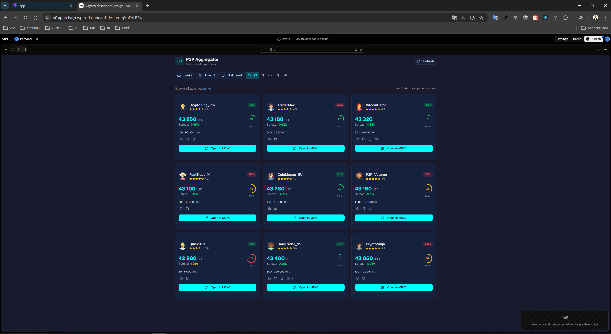
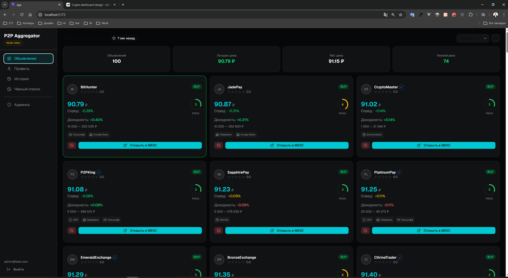
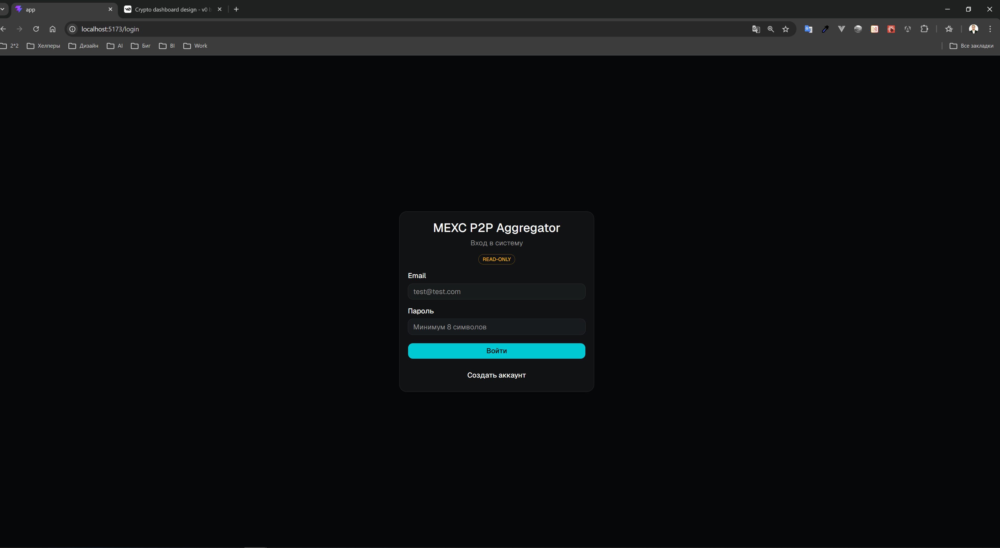
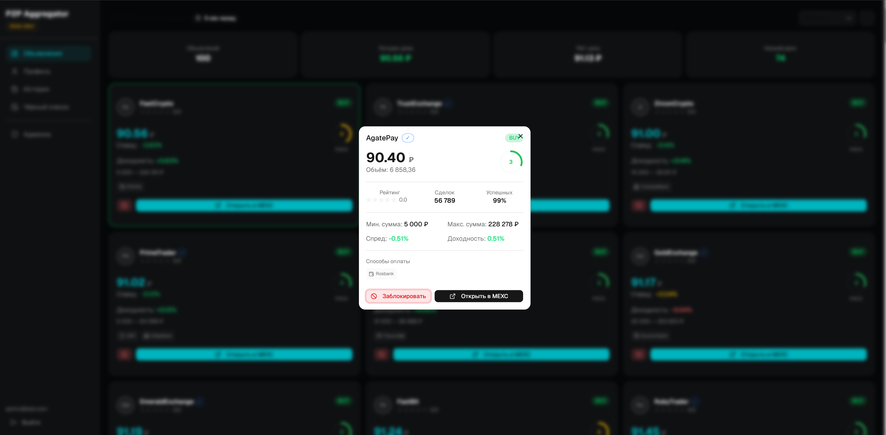
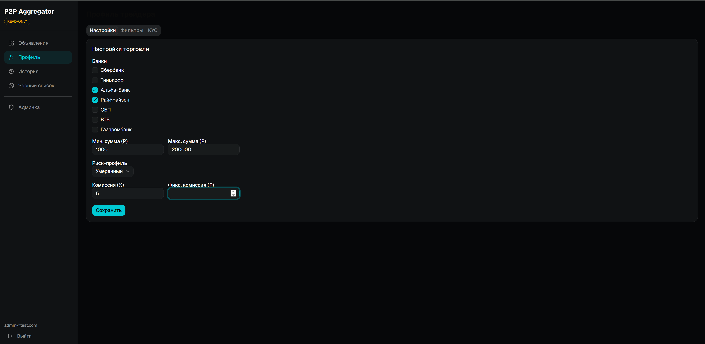
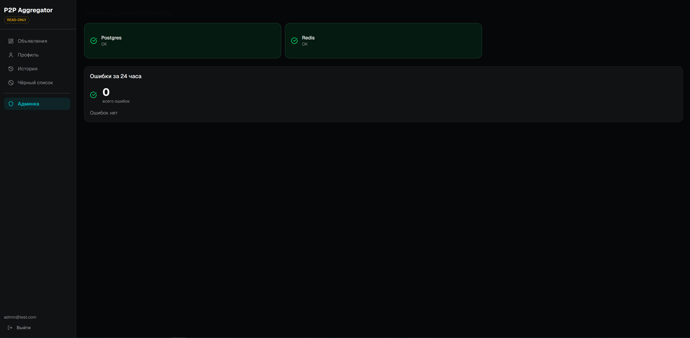
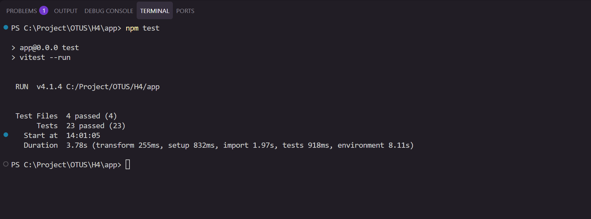
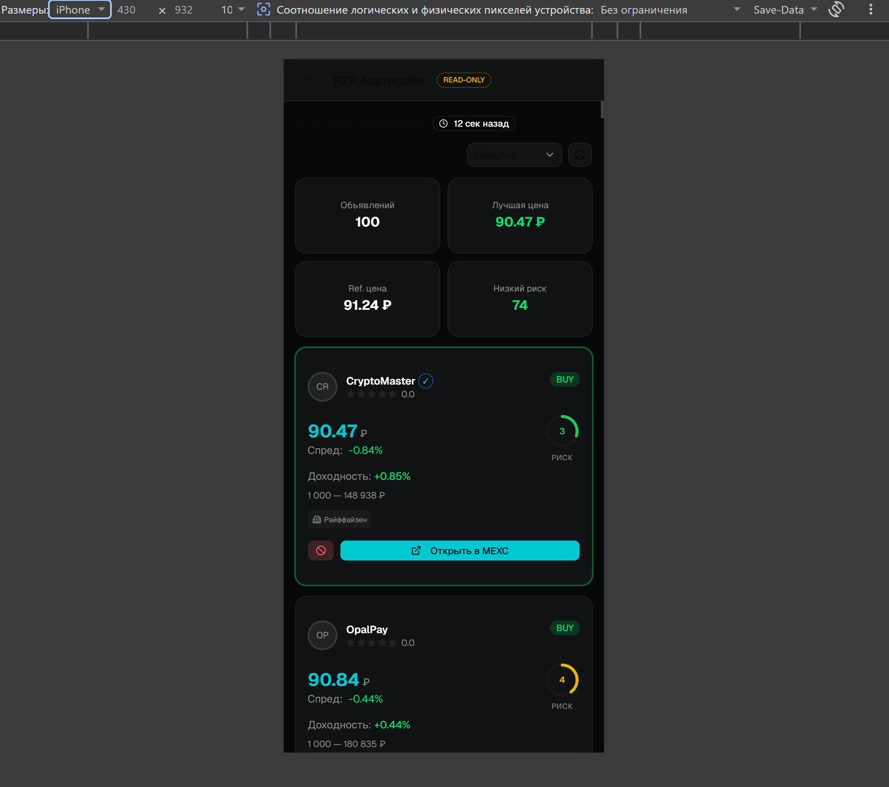
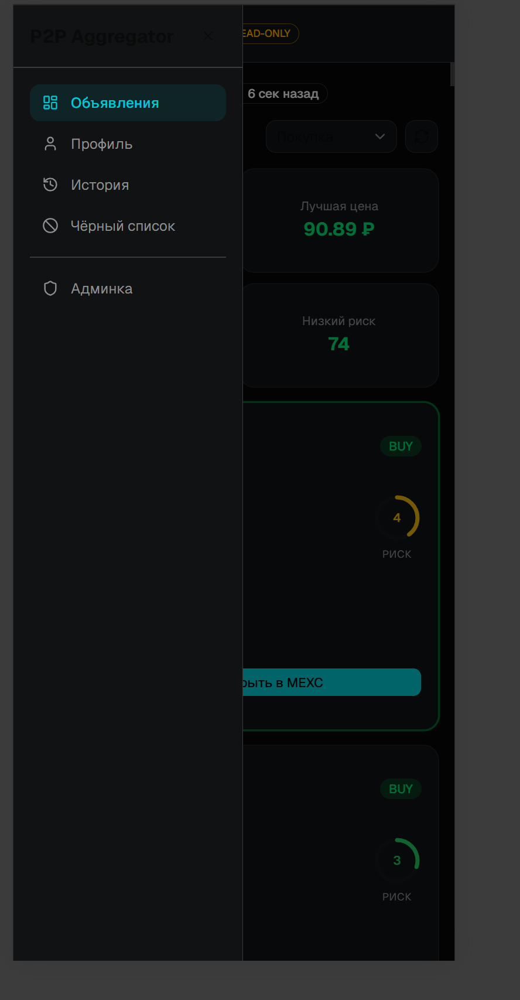

# Отчёт о разработке: H4 — React Frontend для MEXC P2P Агрегатора

## 1. Описание проекта

React SPA-клиент для бэкенда MEXC P2P Агрегатора (H2). Приложение работает в режиме read-only: отображает P2P-объявления с биржи MEXC, анализирует риски мерчантов, позволяет управлять чёрным списком и просматривать историю.

Стек: React 19 + TypeScript + Tailwind CSS 4 + shadcn/ui (Radix) + React Router + Zustand + Vitest.

Бэкенд: FastAPI + PostgreSQL + Redis + mock-server (из H2).

## 2. Процесс разработки по шагам

### Шаг 1. Подготовка технического задания

Использовано ТЗ из H3:
- `technical_specification.md` — 28 функциональных требований
- `user_stories.md` — 14 User Stories
- `ui_concepts/` — UI-концепции (выбрана Концепция 2: карточный интерфейс, dark theme, крипто-эстетика)

Стек зафиксирован в PLAN.md:
- React 18+ / TypeScript — UI-фреймворк
- Tailwind CSS 4 — стилизация, dark theme
- shadcn/ui (Radix) — готовые компоненты
- React Router v6 — маршрутизация
- Zustand — глобальное состояние (auth)
- Vitest + React Testing Library — тесты
- Vite — сборка

Основные функции (3+):
1. Карточки P2P-объявлений с автообновлением, фильтрацией, индикатором риска
2. Авторизация + онбординг + профиль трейдера
3. Чёрный список мерчантов + история просмотров
4. Панель администратора (health-статусы, ошибки)

### Шаг 2. Инициализация проекта

Проект создан с помощью AI-агента (Kiro) через Vite:

```
npm create vite@latest app -- --template react-ts
```

Установлены зависимости:
- shadcn/ui (radix-ui, class-variance-authority, clsx, tailwind-merge)
- react-router-dom, zustand, @tanstack/react-query
- lucide-react (иконки)
- @fontsource-variable/geist (шрифт)

Настроены конфигурационные файлы:
- `vite.config.ts` — алиас `@/`, плагины react + tailwindcss
- `tsconfig.app.json` — paths `@/*`, strict mode
- `index.css` — Tailwind CSS 4 с `@theme inline`, dark theme через CSS-переменные
- `components.json` — конфигурация shadcn/ui

Вместо `.cursorrules` из H2 использованы steering-правила Kiro (`.kiro/steering/`):
- `00-project-core.md` — архитектура, стек, ограничения проекта
- `01-react-rules.md` — правила R1-R7 (именование, компоненты, состояние, API, стили, UI-состояния, тесты)
- `02-shadcn-tailwind.md` — правила S1-S6 (shadcn/ui, импорты, dark theme, сетка, цвета, иконки)

Также установлен скилл `vercel-react-best-practices` для AI-агента.

**Промпт:**
> "Инициализируй React + TypeScript проект на Vite. Установи shadcn/ui, Tailwind CSS 4, React Router v6, Zustand, TanStack Query, Lucide React. Настрой dark theme с cyan accent. Создай структуру: components/, pages/, layouts/, stores/, lib/, hooks/."

### Шаг 3. Реализация базовой структуры

Структура проекта:
```
src/
├── assets/              # Статические ресурсы (hero.png, иконки)
├── components/          # Кастомные компоненты
│   ├── ui/              # shadcn/ui (17 компонентов, не редактировать)
│   ├── __tests__/       # Тесты компонентов (Vitest + RTL)
│   │   ├── ad-card.test.tsx
│   │   ├── risk-indicator.test.tsx
│   │   ├── star-rating.test.tsx
│   │   └── payment-icons.test.tsx
│   ├── ad-card.tsx
│   ├── ad-detail-dialog.tsx
│   ├── risk-indicator.tsx
│   ├── star-rating.tsx
│   └── payment-icons.tsx
├── pages/               # Страницы (по одной на роут)
│   ├── login.tsx
│   ├── onboarding.tsx
│   ├── main.tsx
│   ├── profile.tsx
│   ├── history.tsx
│   ├── blacklist.tsx
│   └── admin.tsx
├── layouts/             # Лейауты
│   ├── main-layout.tsx  # Sidebar + mobile hamburger
│   └── auth-layout.tsx  # Центрированная форма
├── stores/              # Zustand stores
│   └── auth.ts          # Авторизация, JWT, user
├── lib/                 # Утилиты
│   ├── api.ts           # fetch-обёртки (apiGet/Post/Put/Delete)
│   └── utils.ts         # cn() для Tailwind
├── test/                # Настройка тестового окружения
│   └── setup.ts         # @testing-library/jest-dom
├── App.tsx              # Роутинг + providers
├── main.tsx             # Точка входа (ReactDOM.createRoot)
└── index.css            # Tailwind CSS 4 + dark theme переменные
```

Роутинг в `App.tsx`:
- `/login` — авторизация (AuthLayout)
- `/onboarding` — онбординг (ProtectedRoute)
- `/` — главная (MainLayout + ProtectedRoute)
- `/profile`, `/history`, `/blacklist`, `/admin` — защищённые страницы

Auth store (Zustand): login, register, logout, fetchUser с JWT-токенами в localStorage.

API-утилиты (`lib/api.ts`): apiGet, apiPost, apiPut, apiDelete — единые точки входа с автоматическим Bearer token и редиректом при 401.

**Промпт:**
> "Создай App.tsx с роутингом: /login, /onboarding, /, /profile, /history, /blacklist, /admin. Защити все маршруты кроме /login через ProtectedRoute. Создай MainLayout с sidebar-навигацией и mobile hamburger-меню."

### Шаг 4. Разработка компонентов интерфейса

#### Использование v0.dev (Text-to-UI)

Перед реализацией компонентов в Kiro, был использован v0.dev (Vercel) для генерации прототипа UI. В v0.dev был вставлен промпт Концепции 2 из H3 (карточный интерфейс P2P-агрегатора, dark theme, крипто-эстетика). p.s. есть возможность сделать все компоенты с помощью Vercel с учетом работы роутинга, но для этого требуеться тратить деньги, в рамках учебного проект это не целесообразно

v0.dev сгенерировал Next.js-приложение с компонентами:
- `merchant-card.tsx` — карточка мерчанта (mock-данные, USD, шкала риска 0-100)
- `risk-indicator.tsx` — SVG-индикатор риска (круговой, 0-100)
- `filter-bar.tsx` — фильтры-чипсы (банки US, суммы в $)
- `star-rating.tsx` — звёзды рейтинга
- `payment-icons.tsx` — иконки оплаты (generic: bank, card, mobile)

Результат сохранён в `H4/Text-to-UI/Vercel/`.



#### Что переиспользовано из v0.dev

| Компонент v0.dev | Компонент H4 | Что изменено |
|---|---|---|
| `merchant-card.tsx` | `ad-card.tsx` | Типы под бэкенд H2 (Ad interface), добавлены спред, доходность, кнопка блокировки, isBest-индикация |
| `risk-indicator.tsx` | `risk-indicator.tsx` | Шкала 0-100 → 1-10, пороги: ≤3 зелёный, ≤7 жёлтый, >7 красный |
| `star-rating.tsx` | `star-rating.tsx` | Без существенных изменений, адаптирован prop `max` вместо `maxRating` |
| `payment-icons.tsx` | `payment-icons.tsx` | Заменены generic-методы на РФ-банки (Сбербанк, Тинькофф, Альфа-Банк, СБП, ВТБ и др.), добавлены русские лейблы |
| `filter-bar.tsx` | — | Не переиспользован: фильтрация реализована проще (Select BUY/SELL на главной) |

#### Что НЕ переиспользовано (переделано)

- Next.js → Vite + React Router (SPA, не нужен SSR)
- Mock-данные → подключение к бэкенду H2 через `lib/api.ts`
- Одностраничный layout → MainLayout (sidebar) + AuthLayout
- Отсутствующие страницы добавлены: Login, Onboarding, Profile, History, Blacklist, Admin

#### Реализованные страницы

- **LoginPage** — форма входа/регистрации с переключением режимов, валидация, обработка ошибок
- **OnboardingPage** — 4-шаговый визард (банки → суммы → риск-профиль → комиссии) с прогресс-баром
- **MainPage** — карточки объявлений с автообновлением (15 сек), фильтрация BUY/SELL, статистика (объявлений, лучшая цена, ref. цена, низкий риск), таймер обновления
- **ProfilePage** — 3 таба (настройки торговли, фильтры, KYC)
- **HistoryPage** — timeline просмотров, группировка по датам
- **BlacklistPage** — карточки заблокированных мерчантов с разблокировкой
- **AdminPage** — health-статусы сервисов (цветовая индикация ok/degraded/error), ошибки за 24 часа

#### Скриншоты реализованных страниц











Каждая страница обрабатывает 3 состояния UI (правило R6):
1. **Loading** — спиннер (анимированный border)
2. **Error** — сообщение + кнопка retry
3. **Empty** — иконка + текст + действие

**Промпт для компонентов:**
> "Создай компонент AdCard для карточки P2P-объявления. За основу возьми merchant-card.tsx из v0.dev (H4/Text-to-UI/Vercel/). Адаптируй под типы бэкенда H2: Ad interface с полями price, volume, min_limit, max_limit, direction, risk_score, net_yield, spread, merchant. Добавь кнопку блокировки, isBest-индикацию, русские лейблы."

**Промпт для страниц:**
> "Создай MainPage с карточками объявлений. Загружай данные через apiGet('/api/v1/advertisements'). Добавь автообновление каждые 15 секунд, фильтрацию BUY/SELL через Select, статистику (количество, лучшая цена, ref. цена, низкий риск). Обработай loading/error/empty состояния."

### Шаг 5. Тестирование и отладка

#### Настройка тестового окружения

Установлены зависимости:
```bash
npm install -D vitest @testing-library/react @testing-library/jest-dom @testing-library/user-event jsdom
```

Конфигурация в `vite.config.ts`:
```ts
test: {
  globals: true,
  environment: "jsdom",
  setupFiles: "./src/test/setup.ts",
  css: true,
}
```

#### Написанные тесты (23 теста, 4 файла)

**ad-card.test.tsx** (9 тестов):
- Рендер имени мерчанта и цены
- Отображение BUY/SELL badge
- Индикация лучшего предложения (isBest ring)
- Обработка onClick и onBlock (stopPropagation)
- Отображение лимитов (ru-RU locale)
- Отображение доходности
- Бейдж верификации мерчанта

**risk-indicator.test.tsx** (5 тестов):
- Отображение числового score
- Зелёный цвет для низкого риска (1-3)
- Жёлтый для среднего (4-7)
- Красный для высокого (8-10)
- Корректный размер SVG

**star-rating.test.tsx** (5 тестов):
- Числовой рейтинг
- 5 звёзд по умолчанию
- Кастомное количество звёзд
- Правильное заполнение
- Нулевой рейтинг

**payment-icons.test.tsx** (4 теста):
- Отображение русских лейблов банков
- Лимит 3 метода + "+N" для остальных
- Пустой список без ошибок
- Fallback для неизвестного метода

Все 23 теста проходят:
```
 Test Files  4 passed (4)
      Tests  23 passed (23)
```



#### Отладка с AI

- TypeScript-ошибки (неиспользуемый импорт `apiDelete`, unsafe cast в onboarding) — обнаружены через `tsc -b`, исправлены Kiro
- Deprecation `baseUrl` в TypeScript 6 — добавлен `ignoreDeprecations: "6.0"` в tsconfig
- Tailwind CSS 4 не поддерживает `tailwind.config.js` — конфигурация через `@theme inline` в `index.css`
- Dark theme не применялся к вложенным элементам — добавлен `@custom-variant dark (&:is(.dark *))`

**Промпт для тестов:**
> "Настрой Vitest + React Testing Library. Напиши тесты для AdCard, RiskIndicator, StarRating, PaymentIcons. Проверь рендер, ключевые элементы, обработку событий, граничные случаи. Запусти и убедись что все проходят."

### Шаг 6. Адаптивная вёрстка

Адаптивность реализована через Tailwind CSS breakpoints:

| Элемент | Mobile | Tablet (sm) | Desktop (md/lg) |
|---|---|---|---|
| Карточки объявлений | 1 колонка | 2 колонки | 3 колонки |
| Статистика | 2 колонки | 2 колонки | 4 колонки |
| Sidebar | Hamburger-меню (Sheet) | Hamburger | Фиксированный sidebar 224px |
| Header | Видимый (с hamburger) | Видимый | Скрыт (sidebar) |
| Чёрный список | 1 колонка | 2 колонки | 3 колонки |
| Health-статусы | 1 колонка | 3 колонки | 3 колонки |

MainLayout:
- Desktop: фиксированный sidebar (w-56) с навигацией + контент
- Mobile: hamburger-кнопка в header → выезжающий sidebar с overlay

Проверено на размерах: 375px (iPhone), 768px (iPad), 1366px, 1920px.

#### Скриншоты адаптивности





### Шаг 7. Оптимизация и рефакторинг

Код приведён в соответствие со steering-правилами:

| Правило | Описание | Статус |
|---|---|---|
| R1 | PascalCase компоненты, camelCase утилиты, interface для props | ✅ |
| R2 | Функциональные компоненты, один файл — один компонент, `export function` | ✅ |
| R3 | useState для локального, Zustand для auth, useEffect для API | ✅ |
| R4 | Все запросы через `lib/api.ts` (apiGet/Post/Put/Delete) | ✅ |
| R5 | Только Tailwind utility classes + shadcn/ui, без кастомного CSS | ✅ |
| R6 | Loading/error/empty на каждой странице | ✅ |
| R7 | Vitest + RTL, тесты рядом с компонентами | ✅ |
| S1 | shadcn/ui компоненты (Card, Button, Dialog, Badge, Tabs, Select и др.) | ✅ |
| S2 | Импорты из `@/components/ui/` | ✅ |
| S3 | Dark theme через CSS-переменные, `bg-background`, `text-foreground` | ✅ |
| S4 | Адаптивная сетка (grid-cols-1/2/3, sm:/md:/lg:) | ✅ |
| S5 | Цветовая индикация (green BUY, red SELL, yellow warning) | ✅ |
| S6 | Lucide React иконки (h-3/h-4/h-5/h-12) | ✅ |

Оптимизации:
- `useCallback` для стабилизации `fetchAds` (предотвращение лишних ре-рендеров)
- Автоматическая очистка интервалов в `useEffect` cleanup
- Ленивая загрузка данных (fetch при монтировании)
- `stopPropagation` на кнопках внутри кликабельных карточек

### Шаг 8. Оформление результатов

Подготовленные артефакты:

| Артефакт | Файл | Описание |
|---|---|---|
| README | `H4/app/README.md` | Описание проекта, стек, структура, инструкции запуска, Docker, API |
| Отчёт | `H4/development_report.md` | Данный документ |
| Тесты | `src/components/__tests__/*.test.tsx` | 23 теста, 4 файла |
| Docker | `Dockerfile` + `nginx.conf` + `docker-compose.yml` | Production-деплой |
| Steering | `.kiro/steering/*.md` | Правила проекта для AI-агента |
| v0.dev прототип | `H4/Text-to-UI/Vercel/` | Исходный прототип из v0.dev |

## 3. Техники работы с AI

### 3.1. v0.dev (Vercel) — Text-to-UI

Использован для генерации начального прототипа UI. В v0.dev был вставлен промпт Концепции 2 из H3 (карточный интерфейс P2P-агрегатора).

Результат: Next.js-приложение с компонентами merchant-card, risk-indicator, filter-bar, star-rating, payment-icons. Визуальный стиль (dark theme, карточки, цветовая индикация) был взят за основу.

Ограничения v0.dev:
- Генерирует Next.js (не Vite SPA)
- Mock-данные вместо реального API
- Английские лейблы, US-банки
- Одностраничное приложение без роутинга

Вывод: v0.dev полезен для быстрого прототипирования визуала, но требует существенной адаптации под реальный проект.

### 3.2. Kiro — AI-агент для разработки

Основной инструмент разработки. Kiro использовался для:
- Инициализации проекта и установки зависимостей
- Генерации всех страниц и компонентов
- Настройки роутинга, auth store, API-утилит
- Написания тестов
- Рефакторинга и исправления TS-ошибок
- Создания Docker-конфигурации
- Создания README и отчёта

### 3.3. Steering-правила

Ключевая техника — создание steering-файлов (`.kiro/steering/`) с правилами проекта. AI-агент автоматически применяет их при генерации кода. Это обеспечивает:
- Консистентность стиля и архитектуры
- Соблюдение naming conventions
- Правильное использование shadcn/ui и Tailwind
- Обработку всех UI-состояний (loading/error/empty)

### 3.4. Скиллы

Установлен скилл `vercel-react-best-practices`, который добавляет контекст о лучших практиках React (Server Components, performance, accessibility) в промпты агента.

### 3.5. Итеративная разработка

Компоненты создавались итеративно:
1. Базовая версия (из v0.dev прототипа или с нуля)
2. Адаптация типов под бэкенд H2
3. Добавление состояний (loading/error/empty)
4. Стилизация и адаптивность
5. Рефакторинг по steering-правилам

### 3.6. Мультимодальная отладка

- Скриншоты UI использовались для анализа проблем с вёрсткой
- Ошибки из консоли (TypeScript, runtime) интерпретировались AI-агентом
- AI генерировал исправления на основе контекста ошибки

## 4. Проблемы и решения

| # | Проблема | Решение |
|---|---|---|
| 1 | v0.dev генерирует Next.js, а нужен Vite SPA | Переиспользованы только компоненты (merchant-card, risk-indicator, star-rating, payment-icons), остальное написано с нуля |
| 2 | shadcn/ui v4 использует новый формат импортов (`radix-ui` вместо `@radix-ui/*`) | Обновлены импорты во всех компонентах |
| 3 | Tailwind CSS 4 не поддерживает `tailwind.config.js` | Конфигурация через `@theme inline` в `index.css` |
| 4 | Dark theme не применялся к вложенным элементам | Добавлен `@custom-variant dark (&:is(.dark *))` в index.css |
| 5 | Автообновление объявлений вызывало мерцание | Добавлен `useCallback` для стабилизации `fetchAds` |
| 6 | 401 при истёкшем токене не редиректил на логин | Добавлена обработка 401 в `apiFetch` с очисткой localStorage |
| 7 | TypeScript 6 deprecated `baseUrl` | Добавлен `ignoreDeprecations: "6.0"` в tsconfig.app.json |
| 8 | Неиспользуемый импорт `apiDelete` в main.tsx | Удалён при рефакторинге |
| 9 | Unsafe cast `user as Record<string, unknown>` в onboarding | Исправлен на `user as unknown as Record<string, unknown>` |

## 5. Выводы и рекомендации

1. **v0.dev + Kiro = эффективная связка.** v0.dev даёт быстрый визуальный прототип, Kiro адаптирует его под реальный проект с бэкендом, роутингом, авторизацией.

2. **Steering-правила — самый эффективный способ управления качеством AI-генерируемого кода.** Один раз написал правила — агент следует им во всех файлах. Это экономит время на code review и рефакторинг.

3. **shadcn/ui + Tailwind CSS — отличная комбинация для AI-разработки.** Компоненты стандартизированы, агент знает их API, результат выглядит профессионально.

4. **Итеративный подход работает лучше, чем попытка сгенерировать идеальный компонент с первого раза.** Базовая версия → улучшение → рефакторинг — естественный цикл.

5. **Тесты с Vitest + RTL интегрируются за минуты** и дают уверенность в работоспособности компонентов при рефакторинге.

6. **Docker Compose позволяет поднять весь стек одной командой** — frontend + backend + PostgreSQL + Redis + mock-server.

7. **Рекомендация:** для следующих проектов стоит попробовать TanStack Query вместо ручных useEffect + useState для API-вызовов — это упростит кэширование, retry и loading-состояния.
