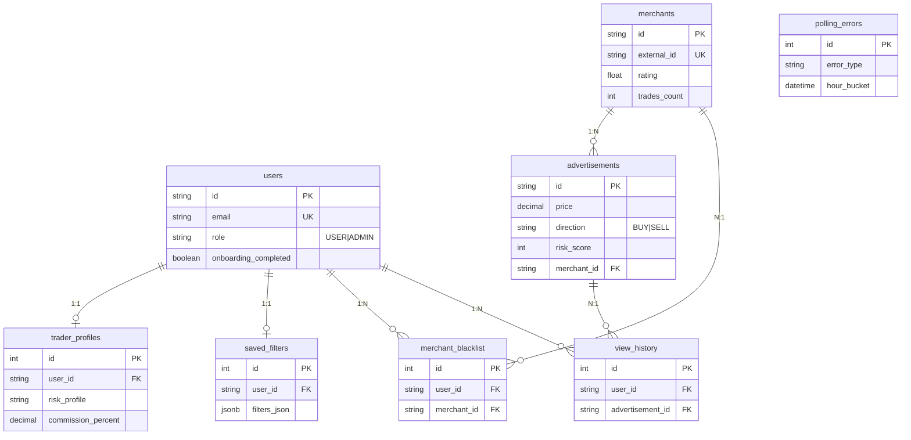
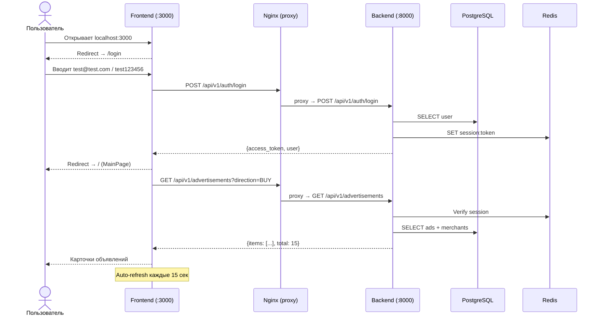

# Отчёт: H5 — Развертывание Backend и интеграция с Frontend

**Курс:** OTUS — AI для разработчиков
**Проект:** MEXC P2P Агрегатор
**Инструмент:** Kiro (IDE-агент)
**Дата:** Май 2026

---

## Шаг 1. Проектирование базы данных

### Сущности и связи

Спроектировано 8 таблиц с использованием AI-агента (Kiro):



### Использование AI для генерации схемы

**Промпт:**
```
Спроектируй схему PostgreSQL для P2P-агрегатора. Требования:
- Пользователи с ролями USER/ADMIN, bcrypt-пароли
- Мерчанты с метриками (рейтинг, сделки, скорость)
- Объявления с ценой, лимитами, направлением BUY/SELL, массивом способов оплаты
- Профиль трейдера (банки, суммы, риск-профиль, комиссии)
- Чёрный список мерчантов (per user)
- История просмотров (последние 50)
- Логи ошибок polling с агрегацией по часам

Стек: PostgreSQL 16, SQLAlchemy 2 async, Mapped[] типизация.
Нужны индексы для фильтрации по currency+direction+is_active.
```

AI сгенерировал базовую схему. Корректировки:
- Добавлен `external_id` (UNIQUE) для дедупликации при polling
- `payment_methods` изменён с JSON на `ARRAY(String)` для эффективного поиска
- Добавлен составной индекс `ix_ads_currency_direction_active`
- `hour_bucket` в polling_errors для агрегации без GROUP BY по timestamp

### Миграции

Создано 3 миграции Alembic:
1. `96090f785ff2` — Initial: users, merchants, advertisements, trader_profiles, saved_filters, polling_errors
2. `5f99c66f9127` — Seed: тестовые пользователи (test@test.com, admin@test.com)
3. `a1b2c3d4e5f6` — V1.1: merchant_blacklist, view_history, onboarding flag, KYC-поля

---

## Шаг 2. Выбор инфраструктурного решения

**Выбор: Self-hosted (PostgreSQL + Redis в Docker)**

Обоснование — проект требует функциональность, недоступную в Supabase:

| Требование | Supabase | Self-hosted |
|-----------|----------|-------------|
| Server-side polling (asyncio, каждые 10 сек) | ❌ | ✅ |
| Кастомный risk-scoring (Strategy pattern) | ⚠️ Edge Functions | ✅ |
| LLM-интеграция + Redis-кэш | ❌ | ✅ |
| Rate limiting middleware | ❌ | ✅ |
| Полный контроль над инфраструктурой | ❌ | ✅ |

Supabase отлично подходит для CRUD-приложений, но MEXC P2P Агрегатор — это проект с серверной вычислительной логикой, фоновыми задачами и внешними интеграциями.

---

## Шаг 3. Развертывание базы данных

### Docker Compose

Весь стек поднимается одной командой:

```bash
cp .env.example .env
docker compose up -d
```

Сервисы:
- `postgres` — PostgreSQL 16 Alpine с healthcheck
- `redis` — Redis 7 Alpine с healthcheck
- `migrations` — Alembic upgrade head (one-shot, зависит от postgres healthy)
- `mock-server` — эмулятор P2P API (FastAPI, порт 8001)
- `backend` — FastAPI API (порт 8000, зависит от migrations + redis + mock-server)
- `frontend` — React SPA через nginx (порт 3000, проксирует /api/ на backend)

### Проверка доступности

```bash
# PostgreSQL
docker compose exec postgres pg_isready -U mexc

# Redis
docker compose exec redis redis-cli ping

# Backend health
curl http://localhost:8000/health
# → {"status": "ok", "dependencies": {"postgres": "ok", "redis": "ok"}}
```

---

## Шаг 4. Создание API

### Реализованные endpoints (20+)

| Модуль | Endpoints | CRUD-операции |
|--------|-----------|--------------|
| Auth | 5 | Register, Login, Logout, Me, Verify |
| Advertisements | 2 | List (с фильтрацией), Get by ID |
| Profile | 6 | Get, Update, Banks, Filters (Get/Put), Onboarding |
| Scoring | 1 | Get explanation |
| Blacklist | 3 | List, Add, Remove |
| History | 2 | List, Record view |
| Admin | 4 | Sources, Toggle, Monitoring, Errors |
| Health | 1 | Health check |

**Минимум 3 CRUD-операции (требование задания):**
1. **Create:** POST /blacklist (добавить мерчанта в чёрный список)
2. **Read:** GET /advertisements (список с фильтрацией и сортировкой)
3. **Update:** PUT /profile (обновить настройки трейдера)
4. **Delete:** DELETE /blacklist/{merchant_id} (удалить из чёрного списка)

### Использование AI для генерации API

**Промпт:**
```
Создай эндпоинт GET /api/v1/advertisements с фильтрацией по currency, direction,
payment_methods, min/max amount. Сортировка по price, risk_score, net_yield.
Используй Depends() для auth и DB session. Исключи мерчантов из blacklist текущего
пользователя. Рассчитай spread и net_yield на лету.
```

AI сгенерировал endpoint, который был доработан:
- Добавлен расчёт reference_price через отдельный сервис
- Добавлена фильтрация blacklisted merchants
- Добавлен on-the-fly scoring для объявлений без risk_score

---

## Шаг 5. Настройка безопасности

### Аутентификация

- **Хеширование:** bcrypt (cost 12)
- **Сессии:** UUID-токены в Redis, TTL 24 часа
- **Передача:** Header `Authorization: Bearer <token>`
- **Автопродление:** TTL обновляется при каждом запросе
- **Logout:** Удаляет сессию из Redis (токен немедленно невалиден)

### Авторизация (RBAC)

```python
class RoleChecker:
    def __init__(self, allowed_roles: list[UserRole]):
        self.allowed_roles = allowed_roles
```

- `require_user` — USER + ADMIN
- `require_admin` — только ADMIN (для /admin/*)
- Обычный USER получает 403 при попытке доступа к admin-эндпоинтам

### CORS

```python
allow_origins=["http://localhost:3000", "http://localhost:5173"]
allow_credentials=True
```

### Дополнительно

- **CSRF (Double-Submit Cookie)** — middleware проверяет совпадение cookie `csrf_token` и заголовка `X-CSRF-Token` для POST/PUT/DELETE. Login и register исключены из проверки.
- **Rate limiting** — счётчики в Redis по IP
- **Секреты** — только в .env, не в коде

---

## Шаг 6. Интеграция Frontend с Backend

### API-клиент

Frontend использует единый модуль `lib/api.ts` с функциями `apiGet`, `apiPost`, `apiPut`, `apiDelete`. Автоматическая обработка 401 (redirect на /login).

### State Management

Zustand store для авторизации: login, register, logout, fetchUser. Токен хранится в localStorage.

### Маппинг страниц → API

| Страница | Запросы к Backend |
|----------|------------------|
| Login | POST /auth/login, POST /auth/register |
| Onboarding | POST /profile/onboarding |
| Main | GET /advertisements (auto-refresh 15s), POST /blacklist, POST /history |
| Profile | GET /profile, PUT /profile |
| History | GET /history |
| Blacklist | GET /blacklist, DELETE /blacklist/{id} |
| Admin | GET /health, GET /admin/errors |

### End-to-end flow



---

## Шаг 7. Обработка ошибок и логирование

### Backend

- `AppException` — кастомный класс с status_code, detail, error_code
- Глобальный exception handler возвращает JSON `{"error": "...", "detail": "..."}`
- Все 5xx логируются с уровнем ERROR
- Polling errors записываются в таблицу `polling_errors`

### Frontend

- 401 → автоматический redirect на /login
- Сетевые ошибки → сообщение + кнопка "Повторить"
- Пустые данные → empty state с иконкой и подсказкой
- Loading → спиннер

### Логирование

- `docker compose logs backend` — все логи бэкенда
- GET /admin/errors — статистика ошибок за 24 часа (для ADMIN)
- Структурированные логи: timestamp, level, message, context

---

## Шаг 8. Тестирование и отладка

### Frontend тесты (Vitest + React Testing Library)

```bash
cd frontend && npm run test
# ✓ 23 tests passed (4 files)
```

Покрытие: AdCard, RiskIndicator, StarRating, PaymentIcons.

### API тестирование (curl)

```bash
# Login
TOKEN=$(curl -s -X POST http://localhost:8000/api/v1/auth/login \
  -H "Content-Type: application/json" \
  -d '{"email":"test@test.com","password":"test123456"}' | jq -r '.access_token')

# Get ads
curl -s "http://localhost:8000/api/v1/advertisements?direction=BUY" \
  -H "Authorization: Bearer $TOKEN" | jq '.total'

# Health
curl http://localhost:8000/health
```

### Отладка с AI

- **Проблема:** `MissingGreenlet` при доступе к `ad.merchant` в async-контексте
  **Решение AI:** добавить `selectinload(Advertisement.merchant)` в запрос

- **Проблема:** Race condition в polling (два параллельных цикла)
  **Решение AI:** distributed lock через Redis SETNX

- **Проблема:** CORS ошибки при запросах с фронтенда
  **Решение AI:** добавить `http://localhost:3000` в BACKEND_CORS_ORIGINS

---

## Шаг 9. Оформление результатов

### Артефакты

| Артефакт | Файл |
|----------|------|
| Docker Compose (весь стек) | `docker-compose.yml` |
| Переменные окружения | `.env.example` |
| Backend код | `backend/` |
| Frontend код | `frontend/` |
| Миграции БД | `backend/alembic/versions/` |
| Документация API | `backend_documentation.md` |
| Отчёт | `repot.md` (этот файл) |
| README | `README.md` |
| Скриншоты | `screenshots/` |

### Скриншоты

> Вставьте скриншоты после запуска `docker compose up -d`:

| # | Что снять | Файл |
|---|-----------|------|
| 1 | `docker compose ps` — все сервисы running/healthy | `screenshots/docker-compose-ps.png` |
| 2 | `curl localhost:8000/health` — JSON с "ok" | `screenshots/health-check.png` |
| 3 | http://localhost:8000/docs — Swagger UI | `screenshots/swagger-ui.png` |
| 4 | http://localhost:3000/login — форма входа | `screenshots/login-page.png` |
| 5 | http://localhost:3000/ — карточки с данными от backend | `screenshots/main-page-data.png` |
| 6 | http://localhost:3000/profile — профиль | `screenshots/profile-page.png` |
| 7 | http://localhost:3000/admin — панель (admin@test.com) | `screenshots/admin-panel.png` |
| 8 | Swagger UI → Try it out → GET /advertisements | `screenshots/api-response.png` |

### Выводы

1. **Self-hosted подход оправдан** для проектов с серверной логикой. Supabase подходит для простых CRUD, но не для polling + scoring + LLM.

2. **Docker Compose** позволяет поднять 6 сервисов одной командой с правильным порядком запуска (healthchecks + depends_on).

3. **Трёхслойная архитектура** (Router → Service → Repository) обеспечивает тестируемость и разделение ответственности.

4. **AI ускоряет разработку** в 3-4 раза на этапах проектирования БД, генерации API и отладки. Особенно эффективен для boilerplate-кода и диагностики ошибок.

5. **End-to-end интеграция** работает: frontend загружает реальные данные с backend, отправляет мутации, обрабатывает ошибки.
